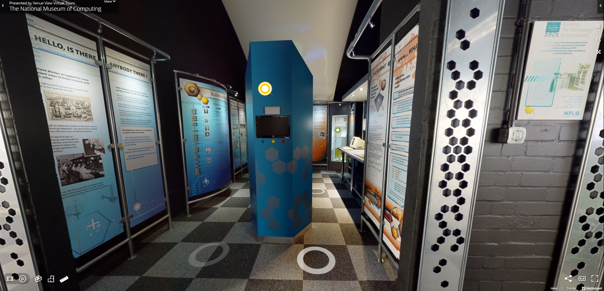
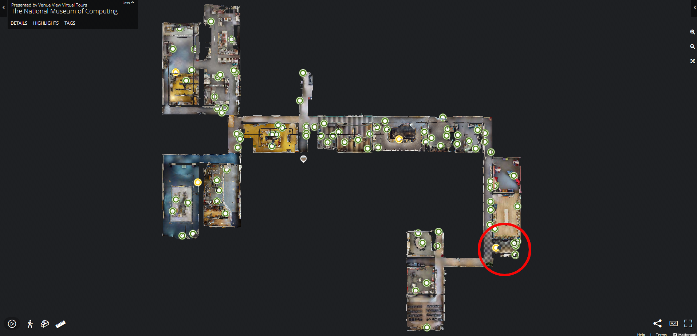
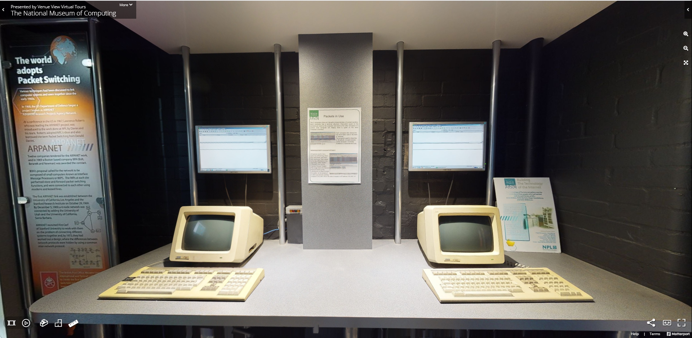
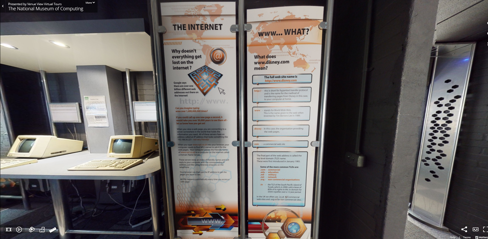

# Internet Gallery at The National Museum of Computing, Bletchley Park

This is the [Internet Gallery](https://www.tnmoc.org/npl-gallery) at [The National Museum of Computing](https://www.tnmoc.org/) in Bletchley Park, as seen in the museum's [virtual tour](https://www.tnmoc.org/3d-virtual-tour).

It charts the origins of the internet with a focus on the National Physical Laboratory - the gallery's original sponsor - and it's early work in developing packet switching. It is less hot on more recent developments as the Internet has become a ubiquitous part of our lives.

This page looks at some ideas for how we at Cisco could use our experience of the networking industry to spruce up the gallery and reward visitors who make it to the furthest reaches of the museum with interesting content and exhibits.

Ideally ideas should touch on one or more of the following areas of focus for the museum:

* Demonstrating _working_ historic systems, not just items in display cases
* Hands-on exhibits that allow visitors to interact
* A focus on education, with information that links to the National Curriculum
* Emphasis on British computing heritage and on ongoing British contribution to innovation and development

---

## Education and Computing Curriculum

The following links give an overview of the networking-related sections of the school computing curriculum, any of which are fair game for this gallery.

* [Networking](https://isaaccomputerscience.org/topics/networking)
* [Network Hardware](https://isaaccomputerscience.org/topics/network_hardware)
* [The Internet](https://isaaccomputerscience.org/topics/the_internet)
* [Security](https://isaaccomputerscience.org/topics/security)
* [Communication](https://isaaccomputerscience.org/topics/communication)

Or take a look at the content of the AQA Computer Science networking modules for [GCSE](https://www.aqa.org.uk/subjects/computer-science-and-it/gcse/computer-science-8520/subject-content/fundamentals-of-computer-networks) and [A Level](https://www.aqa.org.uk/subjects/computer-science-and-it/as-and-a-level/computer-science-7516-7517/subject-content-a-level/fundamentals-of-communication-and-networking)

---

## 1. Interactive software demonstration of networking concepts

There are two existing screens in the gallery on either side of the pillar shown in the image above, at least one of which could be repurposed/replaced. A virtual exhibit has the added advantage that it can also be made available on the Museum's website and used as part of virtual tours - particularly important since at the time of writing the museum is closed to visitors due to covid.

The (Cisco) tool shown in [this video](https://www.open.edu/openlearn/ocw/mod/oucontent/view.php?id=48444&section=3.10) might give some ideas, though this use-case calls for something far more simple that visitors can grasp immediately and only interact with in a couple of limited ways.

---

## 2. A physical exhibit

Currently the gallery has the pair of linked terminals shown below with Wireshark showing the packets they send and receive. While we all love a good hex dump of a packet, is there an alternative way to use this space to show working networking equipment in a way that is more approachable and engaging?

Networking equipment and networks in general aren't known for their visually stimulating qualities so this isn't a straightforward challenge. Bonus points for incorporating Cisco kit.

---

## 3. The web is a bit more important than this...

The boards below are all the gallery has to say on everything beyond ARPANET. The internet and specifically the web is such an integral part of today's society that it deserves more of a mention. Not only that, it is also Britain's key contribution to recent computing history! (Technically Sir Tim Berners-Lee was working at CERN, but if it's good enough for the [2012 Olympic Opening Ceremony](https://www.zdnet.com/article/web-inventor-tim-berners-lee-stars-in-olympics-opening-ceremony/) then it definitely counts!).

There isn't much space here, and linking anything to physical exhibits is hard given the virtual nature of the web. But even just revamping the existing boards to talk about something more relevant to the museum than www.disney.com would be a good start.

The topic of 'Networking Since 1980' incorporates all of Cisco's existence and covers a huge leap forward in technology and thirst for bandwidth driven by new applications. Many of us have directly contributed via the products and protocols we have helped develop, culminating in the cutting edge routers we currently work on. We must have something interesting to show and tell!

